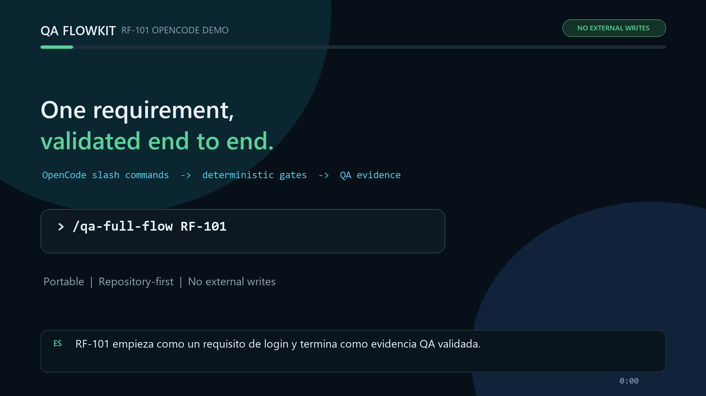

# QA FlowKit

[](LICENSE)
[](package.json)
[](docs/qa-ai/stability-policy.md)
[](https://github.com/warante/QA_FlowKit/actions/workflows/ci.yml)
[](https://www.npmjs.com/package/qa-flowkit)

Convierte el trabajo de QA asistido por IA en un workflow de repositorio repetible y revisable.

Idioma: [English](README.md) | **Español**

QA FlowKit coordina un agente de código mientras scripts deterministas controlan el proceso:

```text
requisito -> análisis de riesgo -> diseño de pruebas -> Gherkin -> datos de prueba ->
entorno -> trazabilidad -> automatización -> ejecución -> análisis de resultados ->
triage de defectos -> release gate -> aprendizaje
```

Las nuevas capacidades (análisis de riesgo, datos de prueba, entornos, ejecución, análisis de resultados,
triage de defectos, observabilidad y ciclo de aprendizaje) son opt-in y por defecto advisory u off.
Ver el [ejemplo de flujo funcional completo](examples/full-functional-flow/).

Está dirigido a equipos de QA y automatización que quieren artefactos generados con IA sin depender únicamente de la
disciplina del prompt. QA FlowKit está actualmente en fase de **candidato a versión estable (RC)**; consulta la
[política de estabilidad](docs/qa-ai/stability-policy.md).

## El Problema Que Resuelve

Los agentes de IA generan pruebas rápidamente, pero los equipos siguen necesitando estructura, trazabilidad,
aprobaciones y validación fiable. QA FlowKit instala esos controles dentro del repositorio destino:

- instrucciones por fase y especialistas reutilizables (incluidos especialistas de estrategia bajo demanda — ver [enrutado de especialistas](docs/qa-ai/specialist-routing-matrix.md); los presets standard incluyen `testDesign.strategyRouting.mode: advisory` para recomendar especialistas por señales en requisitos sin bloquear validadores; `manual-only` mantiene el routing en `off`);
- tracks `quick`, `standard` y `enterprise`;
- estado persistente, reanudable y con registro de eventos;
- validación de Gherkin, trazabilidad, diseño de pruebas, planes de sync y release gates;
- validaciones configurables de cobertura entre features y técnicas de diseño de pruebas trazables;
- validación de cobertura de requisitos no funcionales (NFR) de fuente frente a `normalized-requirements.md`, propuesta y trazabilidad;
- soporte opcional para pruebas de sistemas de IA con tags de componente AI, cobertura de técnicas y evidencia de evals;
- revisión de seguridad funcional e ingesta de requisitos desde fuentes mixtas;
- protección frente a sobrescritura, rutas externas, borrados y secretos;
- planificación proposal-first para Jira, TestRail, Zephyr, Xray y herramientas similares.

La IA razona y edita archivos. QA FlowKit controla el orden, los artefactos obligatorios, las aprobaciones y el
resultado de las validaciones.

## Inicio En Cinco Minutos

Desde el repositorio donde quieres instalar QA FlowKit:

```bash
npx qa-flowkit
```

Abre el repositorio en tu CLI de IA y ejecuta la configuracion guiada:

```text
/qa-init
```

O configura directamente desde la terminal:

```bash
node .qa-ai/scripts/init.mjs
npx qa-flowkit doctor # opcional
```

Usa la superficie de comandos generada:

```text
/qa-help
/qa-add-tests
/qa-full-flow
```

`/qa-help` muestra los comandos del framework y recomienda el siguiente paso QA. Claude Code y OpenCode exponen slash
commands de proyecto mediante adaptadores generados; para agentes sin soporte de slash commands, usa las instrucciones
de adaptador generadas (`AGENTS.md`, `GEMINI.md`, `.codex/README.md`, etc.).

Durante la línea RC, fija instalaciones reproducibles o CI a `npx qa-flowkit@rc ...` cuando necesites el canal `rc`
explícitamente. Cuando el agente cree o actualice artefactos QA, ejecuta `npx qa-flowkit validate-target` como quality
gate del repositorio.

## Demo

| Formato                                                     | Descripción                                                          |
| ----------------------------------------------------------- | -------------------------------------------------------------------- |
| [Video grabado](docs/qa-ai/media/qa-flowkit-rf101-demo.mp4) | Demo quick-track RF-101 de dos minutos con audio en inglés y español |
| [Recorrido estático](docs/qa-ai/demo.md)                    | Historia RF-101, fixtures y salida E2E esperada                      |
| [Guion de grabación](docs/qa-ai/demo-script.md)             | Guion de demo terminal de dos minutos para mantenedores              |
| [Transcripción y subtítulos](docs/qa-ai/demo-transcript.md) | Texto alternativo, subtítulos y fallback reproducible                |
| `npm run test:e2e-quick`                                    | Repetición automatizada en un repositorio destino temporal limpio    |

[](docs/qa-ai/media/qa-flowkit-rf101-demo.mp4)

El demo grabado RF-101 muestra el quick track desde la ingesta del requisito hasta un fallo intencionado del validador,
corrección sin reiniciar, trazabilidad y un target gate aprobado. Las pistas de subtítulos externas están disponibles
en [inglés](docs/qa-ai/media/qa-flowkit-rf101-demo.en.vtt) y
[español](docs/qa-ai/media/qa-flowkit-rf101-demo.es.vtt).

El demo determinista RF-101, incluido un fallo intencionado del validador y su corrección, también está documentado en
[Primeros pasos](docs/qa-ai/getting-started.md#reproduce-the-verified-path). Desde este repositorio fuente puedes
repetirlo:

```bash
npm run test:e2e-quick
```

Para ver un repositorio destino completo que instala y valida el CLI empaquetado, consulta el
[ejemplo publico manual-only](examples/manual-only/README.md):

```bash
npm run test:e2e-manual-example
```

## Qué Instala

```text
.qa-ai/                    framework, reglas, agentes, workflows y validadores
.qa-ai/qa-ai.config.yaml   configuración del repositorio destino (layout compacto por defecto)
.qa-ai/output/             análisis, planes y trazabilidad generados
.qa-ai/features/           diseño QA manual y automatizado en Gherkin
AGENTS.md                  instrucciones genéricas cuando no se elige un override de host específico
```

Los repositorios legacy pueden seguir usando `qa-ai.config.yaml`, `qa-ai-output/`, `features/` y `tests/` en la raíz. QA FlowKit sigue leyendo esas rutas cuando están configuradas o cuando existe el config en raíz.

Las carpetas de automatización se generan solo cuando el preset elegido las requiere. En una terminal interactiva,
`init` muestra un selector de adaptador para tu CLI de IA; en entornos no interactivos detecta carpetas de agentes
existentes y sincroniza esos adaptadores junto con `generic`. Si no hay hosts, solo genera `generic`. Los archivos
existentes se omiten salvo que el usuario indique explícitamente `--force`.

## Elegir Un Track

| Track        | Cuándo usarlo                                 | Salida principal                                                           |
| ------------ | --------------------------------------------- | -------------------------------------------------------------------------- |
| `quick`      | Cambios pequeños y QA manual                  | Requisitos, Gherkin, trazabilidad y resumen de PR                          |
| `standard`   | La mayoría de repositorios de automatización  | Diseño completo, gestión de pruebas, viabilidad e implementación           |
| `enterprise` | Gobierno formal, auditoría o release regulado | Workflow standard más validación estricta y decisión de calidad de release |

El track controla la profundidad; los presets configuran frameworks y herramientas.

## Presets

| Preset                       | Track habitual | Automatización                    |
| ---------------------------- | -------------- | --------------------------------- |
| `manual-only`                | `quick`        | Ninguna                           |
| `playwright-full`            | `standard`     | Playwright UI + API               |
| `maestro-karate-mobile`      | `standard`     | Maestro mobile + Karate API       |
| `karate-full`                | `standard`     | Karate API + UI                   |
| `webdriverio-playwright-api` | `standard`     | Preset de compatibilidad heredado |
| `selenium-jest-browserstack` | `standard`     | Selenium/Jest                     |

Ejemplo:

```bash
node .qa-ai/scripts/init.mjs --preset karate-full --adapters generic,claude
```

O ejecuta `/qa-init` en tu agente de IA para configuracion interactiva.

Consulta el [esquema de configuración](docs/qa-ai/config-schema.md).

## Comandos Principales

| Comando                                               | Propósito                                                  |
| ----------------------------------------------------- | ---------------------------------------------------------- |
| `qa-flowkit`                                          | Copiar el framework `.qa-ai/` al repositorio               |
| `qa-flowkit update`                                   | Actualizar `.qa-ai/` conservando el estado                 |
| `qa-flowkit doctor`                                   | Diagnosticar instalación y configuración                   |
| `qa-flowkit help`                                     | Recomendar el siguiente paso del workflow                  |
| `qa-flowkit run start\|next\|check`                   | Ejecutar un workflow controlado y reanudable               |
| `qa-flowkit metrics`                                  | Reportar KPIs locales desde los eventos de runs            |
| `qa-flowkit validate-target`                          | Ejecutar el quality gate del repositorio destino           |
| `qa-flowkit validate-untrusted-content`               | Escanear requisitos/contexto contra prompt injection       |
| `qa-flowkit validate-features`                        | Validar el Gherkin de diseño QA                            |
| `qa-flowkit validate-test-coverage`                   | Validar obligaciones de cobertura y filas NFR de fuente    |
| `qa-flowkit validate-traceability`                    | Validar trazabilidad RF-prueba y NFR                       |
| `qa-flowkit validate-release-gate`                    | Validar la decisión enterprise de release                  |
| [`qa-flowkit export-report`](docs/qa-ai/reporting.md) | Exportar casos de prueba Gherkin y resultados de ejecución |

La referencia completa está en [Referencia CLI](docs/qa-ai/cli-reference.md).

`qa-flowkit metrics` solo lee estado local bajo `.qa-ai/state/runs/`; nunca lee contenido de artefactos ni envia
telemetria.

## Reglas Deterministas

QA FlowKit valida, entre otras cosas:

- Gherkin en inglés o español según configuración;
- un archivo `.feature` por caso de prueba;
- pruebas manuales también representadas como `.feature`;
- bloques de criterios de aceptación;
- tags obligatorios `@priority:`, `@type:` y `@manual:`;
- instrucciones parecidas a prompt injection en requisitos y contexto QA;
- trazabilidad con RF oficial e IDs de test duplicados;
- lenguaje proposal-first en planes de sincronización;
- evidencias obligatorias del release gate enterprise y resultados de ejecución de pruebas.

Consulta las [reglas Gherkin](.qa-ai/rules/gherkin.rules.md) y el
[índice de reglas](.qa-ai/rules/README.md).

## Agentes Y Adaptadores

El contrato genérico `AGENTS.md` funciona con cualquier agente capaz de leer el repositorio. También hay plantillas
para:

- Claude Code;
- Codex Desktop;
- OpenCode;
- Cline;
- Continue;
- Aider;
- Goose;
- Gemini CLI.

Los adaptadores usan preguntas estructuradas cuando el host las expone y opciones numeradas en caso contrario. El
idioma de interfaz procede de `project.interfaceLanguage`; `gherkin.language` solo controla los `.feature`.

La generación de adaptadores se prueba automáticamente. Los niveles de verificación en hosts reales se documentan
por separado y no equivalen a aislamiento del shell. Consulta
[Compatibilidad de agentes](docs/qa-ai/agent-compatibility.md).

## Seguridad Y Límites

QA FlowKit:

- mantiene estado y artefactos dentro del repositorio;
- rechaza rutas configuradas que escapen del repositorio;
- exige aprobación específica para modificar outputs preexistentes;
- deniega escrituras externas y borrados en el contrato actual;
- trata archivos de requisitos, carpetas de contexto QA y contenido externo importado como datos no confiables;
- escanea esas fuentes no confiables contra instrucciones parecidas a prompt injection, con `--strict` disponible para
  convertirlo en bloqueo;
- escanea artefactos QA en busca de valores parecidos a secretos durante la validación estricta;
- admite hooks nativos de control a nivel de configuración en Claude Code para evitar finalizar el turno con fallos de validación o comprobaciones pendientes.

No aloja ni ejecuta un modelo de IA. Un agente con acceso libre al shell puede operar fuera del harness; consulta
[Arnés para agentes](docs/qa-ai/agent-harness.md) para conocer el límite exacto.

## Actualización

```bash
npx qa-flowkit@rc update
npx qa-flowkit doctor --strict
npx qa-flowkit validate-target
```

`update` sustituye el framework conservando `.qa-ai/state/`, perfiles y artefactos del usuario fuera de `.qa-ai/`.
Consulta la [guía de migración beta a 1.0](docs/qa-ai/beta-to-1.0-migration.md).

## Documentación

| Tema                                | Documento                                                                  |
| ----------------------------------- | -------------------------------------------------------------------------- |
| Primer workflow                     | [Primeros pasos](docs/qa-ai/getting-started.md)                            |
| Comandos y opciones CLI             | [Referencia CLI](docs/qa-ai/cli-reference.md)                              |
| Integración con CI/CD               | [Guía de CI/CD](docs/qa-ai/ci-integration.md)                              |
| Plugin para Claude Code             | [Plugin para Claude Code](docs/qa-ai/claude-plugin.md)                     |
| Arquitectura                        | [Arquitectura](docs/qa-ai/architecture.md)                                 |
| Workflow                            | [Workflow completo](docs/qa-ai/workflow.md)                                |
| Diseño avanzado                     | [Cobertura, técnicas y fuentes mixtas](docs/qa-ai/advanced-test-design.md) |
| Rubrica de calidad Gherkin          | [Rubrica de calidad](docs/qa-ai/quality-rubric.md)                         |
| Harness reanudable                  | [Arnés para agentes](docs/qa-ai/agent-harness.md)                          |
| Solución de problemas               | [Troubleshooting](docs/qa-ai/troubleshooting.md)                           |
| Estabilidad                         | [Política de estabilidad](docs/qa-ai/stability-policy.md)                  |
| Contratos públicos                  | [Inventario de contratos](docs/qa-ai/public-contracts.md)                  |
| Modelo de amenazas                  | [Threat Model](docs/qa-ai/threat-model.md)                                 |
| Medición de pilotos                 | [Metodología de pilotos](docs/qa-ai/pilot-methodology.md)                  |
| Ingesta externa                     | [External Intake](docs/qa-ai/external-intake.md)                           |
| Sync gobernado de pruebas           | [Governed Sync](docs/qa-ai/governed-sync.md)                               |
| Puente de automatización / sanación | [Automation Bridge](docs/qa-ai/automation-bridge.md)                       |
| Roadmap e implementación            | [Roadmap](ROADMAP.md) y [tareas](tasks/README.md)                          |
| Seguridad                           | [Política de seguridad](SECURITY.md)                                       |
| Contribución                        | [Guía de contribución](CONTRIBUTING.md)                                    |

## Repositorio Fuente

Este repositorio mantiene el framework, CLI, CI y paquete npm. Un repositorio QA destino recibe `.qa-ai/`
mediante `npx qa-flowkit`, y luego configura los artefactos QA con `/qa-init` o `node .qa-ai/scripts/init.mjs`.

Antes de proponer un PR:

```bash
npm ci
npm run lint
npm run format:check
npm run docs:check
npm run validate:oss-extraction
node .github/scripts/verify-npm-pack.mjs
```

Las releases usan release-please. No actualices versiones manualmente, publiques localmente ni crees tags de release.
Consulta la [checklist de release](docs/qa-ai/release-checklist.md).

## Licencia

[MIT](LICENSE)
