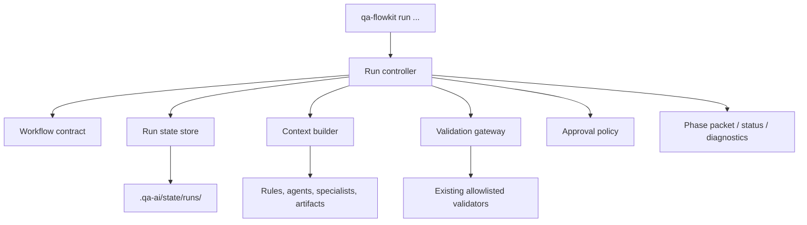
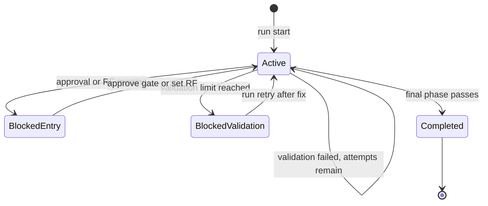

# Agent Harness Architecture

Status: implemented harness with Epic 11 hardening (`TASK-041` through `TASK-046`). MCP/tool-gateway enforcement,
model execution and external writes remain deferred.

## Decision

Implement a lightweight, provider-neutral harness inside the installed `.qa-ai/` framework. It will manage QA
workflow runs but will not invoke or embed an AI model.

The first increment is a deterministic control plane around the existing agents, rules, artifacts and validators.

## Goals

- Persist workflow progress across sessions and agent tools.
- Produce minimal, phase-specific context packets.
- Enforce phase order, local approval gates and validation loops.
- Keep artifacts in the repository as the QA source of truth.
- Preserve dependency-light Node.js 20+ operation and current adapters.

## Non-goals

- Building a general-purpose agent runtime.
- Selecting models or storing provider credentials.
- Capturing chain-of-thought or full prompts.
- Performing external Jira, TestRail, CI or GitHub writes.
- Guaranteeing enforcement against an agent that bypasses QA FlowKit and uses unrestricted shell access.

## Components



### Implemented files

```text
.qa-ai/
  contracts/
    workflow.v1.json
  scripts/
    qa-run.mjs
    validate-workflow-contract.mjs
    lib/
      harness-contract.mjs
      harness-run-store.mjs
      harness-controller.mjs
      harness-context.mjs
      harness-validation.mjs
      harness-paths.mjs
      harness-modification.mjs
  state/
    runs/
      active.json
      <run-id>/
        run.json
        events.jsonl
```

`bin/qa-flowkit.mjs` will map the public `run` command to `.qa-ai/scripts/qa-run.mjs`.

## Workflow contract

`workflow.v1.json` becomes the shared phase registry used by both `qa-help` and the harness. This removes duplicated
phase order and artifact knowledge from prompts and scripts.

Example:

```json
{
  "schemaVersion": 1,
  "phases": [
    {
      "id": "gherkin",
      "name": "Gherkin feature generation",
      "tracks": ["quick", "standard", "enterprise"],
      "guidance": [".qa-ai/agents/gherkin-test-design-agent.md", ".qa-ai/workflows/test-design.md"],
      "inputs": [
        {
          "path": "$config.testDesign.proposalPath",
          "required": false
        }
      ],
      "outputs": [
        {
          "path": "$config.gherkin.featurePath",
          "kind": "featureFiles"
        }
      ],
      "entryApprovals": ["test-design"],
      "validators": ["validate-features"],
      "permissions": {
        "createLocal": "allowed",
        "modifyExisting": "approval",
        "externalWrite": "denied",
        "delete": "denied"
      }
    }
  ]
}
```

Contract constraints:

- No executable shell commands in JSON.
- Validator IDs resolve through an internal allowlist.
- Paths must be literals inside the repository or `$config.<key>` references.
- Track and configured-tool conditions use supported fields, not an expression language.
- Contract validation runs in `doctor` and source-repository CI.
- Runtime path resolution uses `resolveRepoPath` via `harness-paths.mjs` for every config-derived input, output,
  feature root, release gate and hash target. Absolute paths and `..` escapes are rejected before filesystem access.

## Run state

`run.json` is the current snapshot. `events.jsonl` is an append-only audit trail.

```json
{
  "schemaVersion": 1,
  "runId": "RF-123-20260606T120000123Z",
  "workflowVersion": 1,
  "rfId": "RF-123",
  "track": "standard",
  "status": "active",
  "activePhaseId": "gherkin",
  "phases": {
    "gherkin": {
      "status": "active",
      "attempts": 1,
      "outputs": [],
      "lastValidation": null
    }
  },
  "approvals": [],
  "createdAt": "2026-06-06T12:00:00.000Z",
  "updatedAt": "2026-06-06T12:00:00.000Z"
}
```

Run status: `active`, `blocked`, `completed`.

Phase status: `pending`, `active`, `blocked`, `completed`, `skipped`.

State writes must be atomic. Mutating commands acquire an exclusive state lock under `.qa-ai/state/runs/`;
concurrent writes fail with a clear retry message.
Atomic writes use unique temporary files, and run IDs are validated as filesystem-safe single path segments before
state paths are resolved.

## Lifecycle



The default validation attempt limit is two (`DEFAULT_MAX_VALIDATION_ATTEMPTS`). Blocked phases record
`blockedReason`: `entry` (RF/approval) or `validation` (retry limit). `run retry` applies only to
`blockedReason: validation`, resets `attempts` to `0`, appends `phase.retry_requested` to `events.jsonl` and keeps
prior failure events in the log. A failed check never deletes or rewrites user files.

When `permissions.modifyExisting` is `approval`, the controller captures output hashes at phase activation. Outputs that
already existed and changed require scoped approval on gate `modify-existing:<phaseId>`. New outputs and unchanged
pre-existing outputs do not require modification approval. Generic approvals for other gates do not satisfy
modification gates.

## Command behavior

### `run start`

- Load config and workflow contract.
- Resolve the active track and config-based phase skips.
- Atomically reserve a timestamp-based run ID; append a numeric suffix when the same RF and timestamp already exist.
- Create a run snapshot and event log after the ID is reserved.
- Accept an optional `--rf`; phases that require an official RF remain blocked until it is recorded.
- Do not create workflow artifacts.

### `run next`

- Select the first non-completed phase.
- Check entry approvals and required inputs.
- Mark the phase active.
- Return a phase packet containing guidance files, relevant inputs, expected outputs, permissions and validators.
- Return the same packet without another transition when called repeatedly for the active phase.

### `run check`

- Verify expected artifacts.
- Enforce modification gates for changed pre-existing outputs.
- Execute only allowlisted validators.
- Store exit status and concise diagnostics.
- Complete the phase on success.
- Keep it active or block it on failure according to the attempt limit.
- When blocked by validation, return `retryable: true` and refuse further attempts until `run retry`.

### `run retry`

- Apply only when the active phase is `blocked` with `blockedReason: validation`.
- Reset validation attempts to zero and set phase status back to `active`.
- Append `phase.retry_requested` with `previousAttempts` to the event log.
- Do not bypass RF or entry-approval blockers.

### `run approve`

- Record gate ID, decision, timestamp and optional note.
- Reject secret-like approval notes.
- For `modify-existing:<phaseId>` gates, require the gate to match the active phase and pending modified outputs.
- Unblock only phases that require the approved gate.

### `run set-rf`

- Validate and record the confirmed official RF ID.
- Append the change to the event log.
- Unblock phases whose only blocker was the missing RF ID.

### `run status` and `run resume`

- `status` is read-only, supports human and JSON output, and reports current blockers for the active phase.
- `resume` selects an existing run as active, persists its phase baseline under the run lock and returns its current
  phase packet.
- `resume` refuses completed runs; completed state remains immutable in the first iteration.

## Phase packet

`run next --json` returns a stable object:

```json
{
  "runId": "RF-123-20260606T120000123Z",
  "phase": {
    "id": "gherkin",
    "status": "active",
    "guidance": [],
    "inputs": [],
    "outputs": [],
    "validators": [],
    "permissions": {}
  },
  "blockers": [],
  "recommendedCommand": "npx qa-flowkit run check"
}
```

Context files are referenced, not copied into state. Adapters decide how to load those files into their own agent
context.

## Validation and recovery

The first increment uses validator process exit codes and captures bounded stdout/stderr diagnostics. Structured
`--json` validator output can be added incrementally without blocking the harness.

```mermaid
sequenceDiagram
  participant A as Agent
  participant H as Harness
  participant V as Validator
  A->>H: run next
  H-->>A: phase packet
  A->>A: create or update approved artifacts
  A->>H: run check
  H->>V: execute allowlisted validator
  V-->>H: exit code and diagnostics
  alt valid
    H-->>A: phase completed; next phase available
  else invalid
    H-->>A: same phase; remediation diagnostics
  end
```

## Compatibility

- `qa-next-steps.mjs` will read the shared contract but retain artifact inference when no run exists.
- `qa-help` will prioritize an active run, then fall back to current stateless recommendations.
- `validate-target` remains independent of run state so CI validates repository outputs, not orchestration metadata.
- `update` already preserves `.qa-ai/state/`; run schemas must be backward compatible within the beta migration
  policy.
- Agent adapters will instruct agents to call `run next` and `run check`, but existing commands remain supported.

## Security and audit

- Resolve all paths with `resolveRepoPath`.
- Allowlist validator IDs and script locations.
- Store no secrets, prompt transcripts or model reasoning.
- Redact secret-like diagnostics before writing events.
- Deny external writes and deletes in the contract.
- Record timestamps, phase transitions, validator IDs, exit status and artifact hashes.
- Do not add run files to the init manifest; they are operational state, not generated ownership records.

## Implementation order

1. Shared workflow contract and contract validator.
2. Atomic run store, event log and locking.
3. `qa-run.mjs` with `start`, `status`, `next`, `check`, `set-rf`, `approve`, `resume`.
4. Validator gateway, approval policy and retry behavior.
5. `qa-help`, `doctor`, npm CLI and adapter integration.
6. Native Node tests, smoke coverage, golden-target coverage and public docs.

## Completion criteria

- A run can start in each QA track and calculate the same skips as `qa-help`.
- Another agent session can resume the run without reconstructing phase state manually.
- A phase cannot advance when required outputs, approval or validation are missing.
- External writes and deletes are denied by every shipped contract.
- Concurrent state mutations do not corrupt run files.
- Existing non-harness workflows remain functional.
- `npm run validate:oss-extraction` and npm pack verification pass.

## Deferred

- MCP/tool gateway for strong write enforcement.
- Agent or model invocation.
- Parallel phase execution.
- External integration writes.
- Remote run state or dashboards.
- Automatic deletion or archival of run history.
