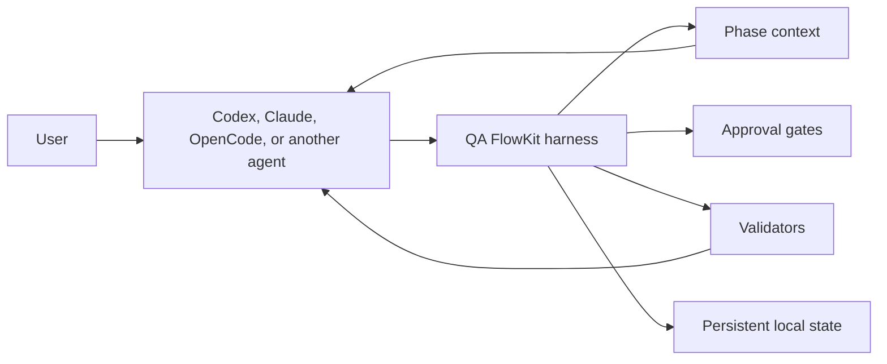

# Agent Harness

Status: MVP implemented with Epic 11 hardening (`TASK-041` through `TASK-046`). The harness is production-usable for
local runs, but MCP/tool-gateway enforcement, model execution and external writes remain deferred.

QA FlowKit evolves from a documented workflow into a repository-native agent harness. The AI agent still reasons and
edits files; QA FlowKit provides deterministic workflow state, phase selection, approvals and validation.

## What changes

Today, `qa-help` infers progress from existing artifacts. The harness adds an explicit run that can be resumed across
agent sessions and tools.



The harness remains:

- Local and repository-first.
- Independent of model or agent provider.
- Compatible with the existing adapters.
- Uses the same `.qa-ai/workflows/command-interaction.md` language and choice protocol across adapters.
- Proposal-first and read-only for external systems.
- Optional: current `/qa-full-flow` and `qa-help` usage continue to work.

## Commands

| Command                             | Purpose                                                  |
| ----------------------------------- | -------------------------------------------------------- |
| `npx qa-flowkit run start`          | Start a resumable QA workflow run                        |
| `npx qa-flowkit run status`         | Show the active phase, blockers and completed work       |
| `npx qa-flowkit run next`           | Return the next phase context and expected outputs       |
| `npx qa-flowkit run check`          | Validate the active phase and advance when it passes     |
| `npx qa-flowkit run retry`          | Reset validation attempts for a validation-blocked phase |
| `npx qa-flowkit run set-rf <id>`    | Record the confirmed official RF ID                      |
| `npx qa-flowkit run approve <gate>` | Record an explicit approval and unblock the next step    |
| `npx qa-flowkit run resume <id>`    | Resume a previous run                                    |

Commands that return status or phase packets support `--json` for agent and CI consumption. In `--json` mode, stdout
contains JSON only; errors go to stderr with a non-zero exit code.

## Expected usage

```bash
npx qa-flowkit run start --rf RF-123
npx qa-flowkit run next
```

If the official RF ID is confirmed after intake, record it before Gherkin generation:

```bash
npx qa-flowkit run set-rf RF-123
```

The agent reads the returned phase packet, produces the requested local artifacts and then runs:

```bash
npx qa-flowkit run check
```

If validation fails, the same phase remains active with concise remediation output. After the configured attempt
limit (`2` by default), the phase is blocked with `blockedReason: validation` until you correct artifacts and run:

```bash
npx qa-flowkit run retry
npx qa-flowkit run check
```

`run retry` resets validation attempts to `0` and records `phase.retry_requested` in the event log. It does not bypass
RF or entry-approval blockers.

If an approval is required, the run becomes blocked until the user approves the named gate:

```bash
npx qa-flowkit run approve test-design
npx qa-flowkit run next
```

When a phase output already existed before activation and `modifyExisting` is `approval`, the phase packet includes
`modificationGate: modify-existing:<phaseId>`. Approve that scoped gate before `run check`:

```bash
npx qa-flowkit run approve modify-existing:intake
```

Generic approvals for other phases do not satisfy modification gates.

## Run state

State is stored under:

```text
.qa-ai/state/runs/
  active.json
  <run-id>/
    run.json
    events.jsonl
```

The state records phase status, artifact paths, validation results and approvals. It does not store prompts,
credentials, hidden model reasoning or file contents.

Run IDs use the RF and creation timestamp. If that ID is already reserved, the harness atomically adds a numeric
suffix, so separate CLI processes can start runs safely without overwriting state. Resuming a run persists the
selected phase baseline before returning control, and `run status` reports current blockers without changing state.

## Human control

The harness enforces approvals inside the QA FlowKit run:

- Creating new local artifacts: allowed when the phase contract permits it.
- Modifying existing tests or user-edited artifacts: scoped approval required (`modify-existing:<phaseId>`).
- External writes: denied.
- Deletes: denied.

Config-derived paths are resolved with `resolveRepoPath` at runtime. Absolute paths and paths that escape the
repository are rejected before filesystem access.

An agent with unrestricted shell access can still act outside the harness. Strong tool-level enforcement is a later,
optional MCP or tool-gateway capability.

## Relationship to existing commands

- `qa-help` remains the stateless fallback and can recommend starting or resuming a run.
- `validate-target` remains the final repository gate.
- `doctor` exits non-zero when the workflow contract is invalid.
- Existing validators remain the source of pass/fail decisions.
- Existing slash commands remain valid and use the active run when one exists.

See [Agent harness architecture](agent-harness-architecture.md) for the technical design and
[Backlog](backlog.md) for implementation tasks.
