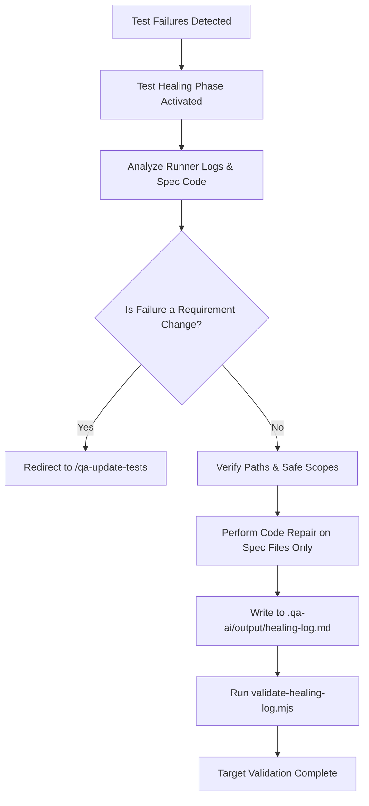

# Automation Bridge & Governed Healing Loop

This document describes the interface and workflow handoff between the QA FlowKit framework, external automation execution agents (such as Playwright, WebdriverIO, or API testing engines), and the governed healing loop.

## Overview

The automation bridge enables a closed feedback loop:

1. **Intake and Design**: Requirements are parsed, Gherkin features are generated, and a traceability matrix is created.
2. **Implementation**: Automation specialists create spec files, page objects, and helper scripts according to configured frameworks.
3. **Execution**: Automation suites run (via local or CI execution runner).
4. **Governed Healing**: If execution fails, the test healing phase identifies and applies fixes to selectors/assertions, logging the details securely.



## The Healing Loop

When `automation.healing.enabled` is set to `true` in `qa-ai.config.yaml`, the `healing` phase is activated in `standard` and `enterprise` tracks.

### 1. Safety Boundaries & Path Protection

To prevent agents from modifying business expectations, the healing loop enforces strict file isolation rules:

- **No Feature File Edits**: The healing loop is strictly forbidden from modifying any Gherkin `.feature` design files or changing business expected outcomes.
- **Spec Files Only**: Modifications are restricted to test spec files, page objects, mock files, and test helpers defined in:
  - `automation.ui.specsPath`
  - `automation.ui.pageObjectsPath`
  - `automation.api.specsPath`
  - `automation.mobile.flowsPath`
- **Path Escape Prevention**: Path resolving ensures that relative file paths do not escape the workspace root or point to forbidden areas (such as `features/` directories).

### 2. Governed Healing Log (`healing-log.md`)

Every healed test must be documented in `.qa-ai/output/healing-log.md`. This log serves as the audit trail for automated modifications.

#### Format

The log is a Markdown table with the following columns:

- **Test ID**: The exact test case identifier mapping to the traceability matrix (e.g. `RF-003-TC-001`).
- **File Path**: The relative workspace path of the file that was repaired.
- **Repair Type**: Must be one of the following:
  - `locator`: Selector correction or DOM query adjustment.
  - `wait`: Timeout extension or asynchronous condition polling.
  - `cleanup`: Database state reset, session clearing, or resource disposal.
  - `data`: Fixture update, payload modification, or environmental parameter adjustment.
- **Justification**: A descriptive explanation of why the change was made, having a **minimum length of 30 characters**.

#### Validation Command

To verify that the healing log conforms to schema rules, run:

```bash
node .qa-ai/scripts/validate-healing-log.mjs
```

The validator performs the following checks:

- Matrix verification: Resolves and ensures the `Test ID` exists in the traceability matrix.
- Allowed Repair Types: Validates that types match `locator`, `wait`, `cleanup`, or `data`.
- Minimum Justification Length: Rejects justifications under 30 characters.
- Path protection: Checks that resolved paths reside within the configured specs directories, do not resolve to features directories, and do not end in `.feature`.

## Handoff to `/qa-update-tests`

If a test fails because a business rule or requirement has changed, the healing loop must not repair it.
Instead:

1. The agent stops.
2. The agent redirects the workflow to `/qa-update-tests`.
3. The user or designer updates the Gherkin design files first.
4. The new Gherkin features pass through target validation before automation implementation plans are refreshed.

## Governed Test Impact Analysis

Test impact analysis helps QA teams run only the subset of tests affected by code changes (e.g. in PRs or branches), saving execution time in CI/CD pipelines while preserving coverage guarantees.

### 1. Analysis Report (`test-impact-analysis.md`)

When a developer submits a PR or code changes, the impact agent analyzes the repository diff and creates `.qa-ai/output/test-impact-analysis.md`. The format must be a Markdown table under `## Impacted Areas`:

- **Changed area**: Description of the modified code area.
- **Affected RF**: The requirement ID impacted (e.g. `RF-101`).
- **Affected test IDs**: Comma-separated list of affected test IDs.
- **Inclusion reason**: Rationale for why this area was marked affected.

A final list under `## Selected Test IDs` specifies all unique test IDs to be executed.

### 2. Validation Rules & The Superset Rule

To ensure that teams do not run fewer tests than necessary, the validator enforces two rules:

- **Union Check**: The list under `Selected Test IDs` must exactly equal the union of all test IDs in the `Affected test IDs` column in the table (preventing silent additions or removals).
- **Superset Rule**: If an RF is listed in the `Affected RF` column, **all test cases linked to that RF in the traceability matrix** must be present in the final list. You can select more test cases, but never fewer than what the matrix requires.

To run the validator:

```bash
node .qa-ai/scripts/validate-test-impact.mjs
```
